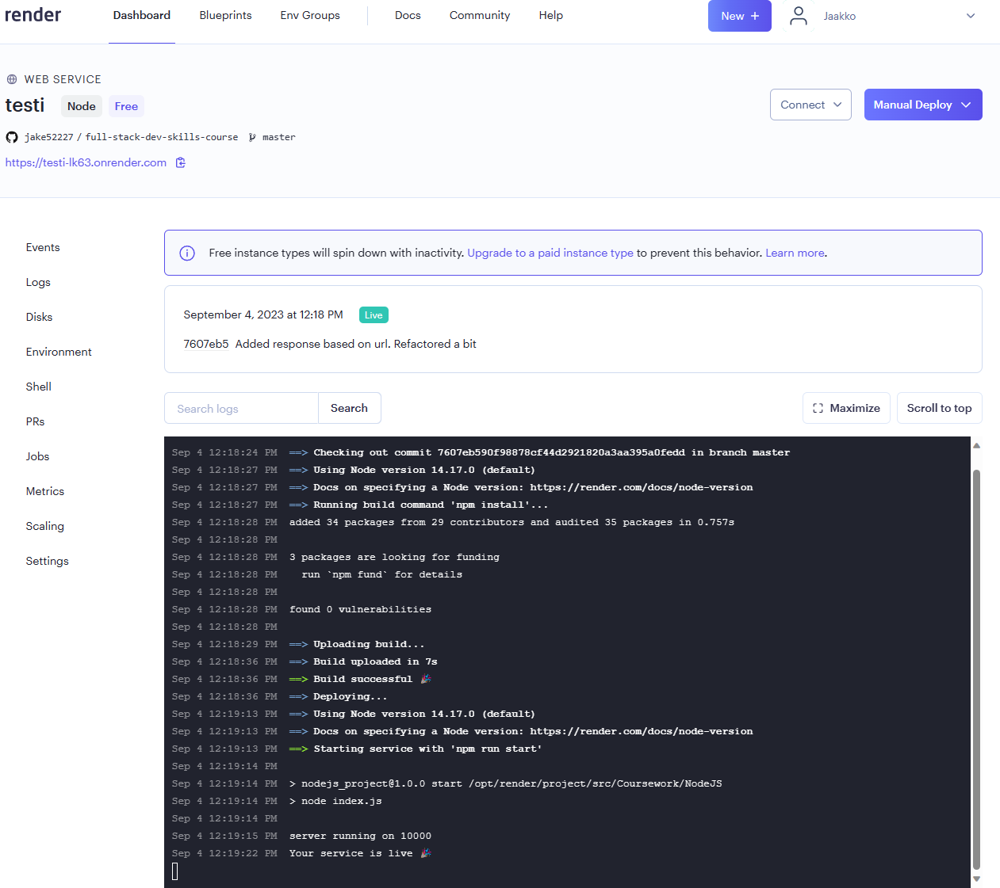

Lappeenrannan teknillinen yliopisto
LUT School of Engineering Sciences

Sofware Development Skills

Jaakko Pyrhönen, 0612226 

LEARNING DIARY, FULL STACK MODULE

# 3.9.2023

## General information and setting up the environment

I checked the general information and understood the main focus of the course. I chose the full stack module, because I want to strengthen my overall development skills. To no one's suprise, my editor of choice is the popular VS Code.

Currently I'm using Windows. I decided to create a directory for the project in WSL, because I find development on a Linux environment more enjoyable.

Then I set up the public git repository, and decided to get to it. 

## The GIT video 

I decided to start with the video about using GIT. I'm already quite familiar with basic usage of GIT, so the video did not teach me anything that I did not already know. It was still a good review about:
- What GIT actually is, and what are its main characteristics and concepts
- The basic commands for local repositories
- How to use files like `.gitignore`.
- The basic commands for remote repositories
- The basic use of branches.

## The NodeJS video part 1: building the server

After the GIT video I started going through the NodeJS video/project. I have used NodeJS before, but not extensively (and mostly with ExpressJS) so I learned quite a bit about the core modules and more about how NodeJS actually works under the hood.

Some interesting things I learned:
- NodeJS modules are wrapped in a function, which provides the `exports, require, module, __filename`, and `__dirname` through the arguments to the whole module.
- The `path` module provides good functions for handling file paths
- The `fs` module provides functions for interacting with the file system
- The `os` module provides functions for getting information about the whole system
- You can handle URLs with the `url` module functions
- You could create your own event emitters with the `events` module
- You can easily create a simple HTTP server by using the `http` module.

The next thing I should do is the deployment. Heroku is no longer free, so I have to figure out another service. I'll do this tomorrow.

# 4.9.2023

## The NodeJS video part 2: deploying the app

I decided to use [render](https://render.com/) for deploying the app. I connected my Github account to render for easy access to the course repository.

After the setup I selected the "new web service" option from the dashboard. I set the root directory for the deploy to `Coursework/NodeJS`. I selected Node as the runtime, and `npm install` as the build command. I set `npm run start` as the start command. Lastly, I selected the free deployment option and pressed "Create Web Service".

The deployment appeared to be successful. Image shown below:

The app was deployed to https://testi-lk63.onrender.com/ where It seemed to work as expected. It seems that render automatically assigns the environment variable `PORT`, since the service is running on port 10000. The deployment was surprisingly easy. It would presumably be more complicated for more complex applications (and depending on the service).

## The MongoDB video

First I installed MongoDB on Ubuntu 22.04 (WSL) by following [the documentation](https://www.mongodb.com/docs/manual/tutorial/install-mongodb-on-ubuntu/).

After installation I started the service with ` sudo systemctl start mongod`. After running `sudo systemctl daemon-reload`, `sudo systemctl status mongod` verified that the service is running correctly.

I started the shell with `mongosh` and started to follow the video's examples.

I learned that:
- MongoDB is a NoSQL database. Its highly scalable with built in replication and sharding.
- MongoDB stores related documents in collections. Collections are created in databases on the cluster.
- The documents are very similar to JavaScript objects but they use a format called BSON with some additional features compared to JSON.
- There is no need to define the structure of data beforehand, like in relational databases. Instead we can insert whatever kinds of objects we'd like to collections.
- MongoDB supports basic CRUD operations with `insert`, `find`, `update`, and  `remove`.
- We can use special operators like `$set`, `$rename`, `$elemMatch`, `$gt`, `$lt`, and so in the CRUD operations.
- Indexes can be created with `createIndex()`. MongoDB supports several types of indexes, like Text indexes.
- MongoDB offers a Database-as-a-Service solution called Atlas. The Atlas cloud service reduces the headache of managing databases yourself.
- Once a cluster is created in Atlas, you can connect to it with a connection string. Your IP address needs to be whitelisted first, because every IP is blocked by default.

This time we only used the shell to get familiar with the basic usage of MongoDB.

## The ExpressJS video part 1: Basic server and logger middleware

So far I learned that:
- Express makes creating a server with Node a lot easier.
- You can easily create static/dynamic sites, APIs, microservices, etc.
- You can easily register middleware functions with `app.use()`. **Middleware functions** are functions which have access to the request and response objects, and which are executed in order of registration. The middleware function has access to the `next` function in the stack of functions executed before reaching the actual route. Middleware functions are triggered every time a request is sent by the client.
	- A simple example is a logger middleware, which just logs information about the request before the code of the route is executed.
- Express allows for easy definition of routes by the HTTP method used, e.g `app.get()`, `app.post()` and so on.

# 5.9.2023

## The ExpressJS video part 2: more middleware and template engines

In the latter part of the video we did kind of the same things, but some new things I learned were:
- You could extract Express routes to separate files by using router objects
- You need separate middleware to parse the data to the request object's `body` attribute from HTTP requests's body (e.g POST and PUT data).
- You could use template engines, like handlebars, to render HTML documents dynamically on the server side and send them to the client. The template engine subsitutes variables to a template file and creates it "on the fly" before sending the response.

# 6.9.2023
## Angular part 1

I started going through the "Your first Angular app" tutorial and immediately faced some relatively obscure issues. The problems were fixed by downgrading node to version 18.10.0, and I could start following the tutorial.

Today I got through the tutorial's lessons 1 to 12. Angular is completely new to me so I learned quite a bit:
- Angular is a development platform built on TypeScript. A central part of Angular are **components** (like in React). Angular also offers several other tools for things suchs as routing, forms, etc.
	- Components are defined with a `@Component` decorator.
	- Every component has HTML associated with it - either inline or from a file
	- We can use interpolation, directives (like ngIf or ngFor) and other features to alter the template dynamically.
- Angular comes with a CLI with which the developer can easily create new components, interfaces, services and so on.
- Angular provides nice support for **dependency injection** such that, for example, services and other components are easy to use elsewhere.
- Parent components can pass data to their child components with `@Input`. The parent component passes the data through the child components tag in the template.
- Routing is a feature where a component can be substituted in place of `<router-outlet></router-outlet>` tags. The component which is shown is determined by the URL, which corresponds to the configured route path in the application.
- Angular offers tools for easy handling of forms. For example, you can create a member variable for the form and it's fields in the component class, add the form markup in the template, and register a callback function, which handles the form submission event.

# 7.9.2023

## Angular part 2

I finished the Angular tutorial and learned that:
- You can declare template variables in Angular. These can be referenced elsewhere in the template for easy access of values.
- It's useful to use JSON server or similar tools during development to simulate the communication with a server

## MEAN stack parts 1, 2, 3, 4

Today I did parts 1,2,3 and 4 of the "front to back" series. Two relatively new things to me were the mongoose ODM and usage of the passport module.

### Mongoose ODM and the database connection

- Without Mongoose we would likely just use the MongoDB driver with which the Node.js application could interact with the MongoDB database. **Mongoose ODM** makes the interaction easier.
- An **ODM** is a bit like an **ORM**, but instead of handling tables and relations an ODM maps documents to objects - in this case JavaScript objects.
- **Object models** are defined by the programmer. In the video we create a `User` model, which defined fields like username, password, etc.
- Once the mapping is complete, we can interact with the database through the object model's methods.

## Passport library and handling of the JWT

The application will authenticate users with a **JSON web token**. JWTs are handy for example because once they're signed with information, they will contain that information in an encoded format for future requests. This means that we don't need to create a separate identifier for the user's session, since the JWT already provides the necessary data about the user once it's decoded at the server.

As with the database connection, JWTs could also be handled without extra help, but the tutorial decided to make things a bit easier by using the **passport** module for handling authentication & authorization. Passport offers middleware functions and supports several different authentication strategies, including JWT.

The programmer creates a function, which is used for verifying the JWT of an incoming request, where the JWT is included in the **Authorization** part of the HTTP headers. The function is registered for use with `passport.use`, and passport offers a ready-made way to extract the JWT from the request with `fromAuthHeaderWithScheme("jwt")`. The function can now be used as middleware for a secure route by using `passport.authenticate()` in the route definition.

# 8.9.2023

## MEAN stack parts 5, 6, and 7

I tried to install the older version of node and angular cli, but that managed to break the app (I've been using a different version of node than the tutorial all along, and made some adjustments to the code), so I think I'm just going to continue with the latest versions, see what comes up, and adapt the code as needed.

The first thing that came up was that this time the Angular app uses **NgModule**. In the last tutorial I used **standalone** components:
- Standalone components are not part of any module. In the tutorial they were created by adding the `--standalone` tag to the Angular-CLI command.
- With standalone components we had to import other standalone components if we wanted to use them
- With NgModule the components are bundled together. The module definition is in `app.module.ts`.
- A module can use other modules, so for example the Router module is imported to the module definition

Fortunately I did not have to do that many modifications:
- I used a newer version of bootstrap so some of the CSS classes were a little different.
- I handled the registration form by using `FormGroup` like in the Angular tutorial.
- The Angular 2 flash messages module is not supported, so I decided to use the [sweetalert2 module](https://www.npmjs.com/package/sweetalert2/v/11.1.7), which is just as easy to use.
- The Http module no longer exists, so I learned how to use the `HttpClient` with [this tutorial](https://angular.io/guide/understanding-communicating-with-http). The funcionality seems to be almost identical though.

Other than that the video followed the same pattern as in the Angular tutorial. 

One last new thing was the **observer pattern**, which appeared in the context of `HttpClient`.  According to [this website](https://www.telerik.com/blogs/angular-basics-how-to-use-httpclient), the Observable in this case is similar to a JavaScript `Promise`, but it's not part of JavaScript, so it uses a popular library called **RxJS (Reactive Extension for JavaScript)** for i'ts implementation. The idea is very similar to Promises: you create the asynchronous action (with `subscribe` in this case) and register a callback function, which triggers when the observable emits an event.

# 9.9.2023

## MEAN stack parts 8 and 9

From these parts I learned:
- how to handle local browser session data with Angular (JWT and user data)
- how to use guard routes in newer versions of Angular by following [this article](https://blog.taditdash.com/demystifying-angular-16-route-guard)
- how to set up environment-dependant variables for the build version of Angular apps by following [this article](https://dev.to/mick_patterson_/how-to-use-environment-variables-in-an-angular-app-92g).

# 10.9.2023
## MEAN stack part 10: deployment

I just skimmed through the last part of the tutorial, since I don't want to pay for Heroku. Instead I did the following:
- For the database connection I settled with using MongoDB atlas, since it has a free tier. First I set up a cluster, an admin user (for connecting) and got the connection URI for that user.
	- In the app I changed the connection URI to be handed in through an environment variable
	- I installed and set up [cross-env](https://www.npmjs.com/package/cross-env), so the NPM scripts would work on other platforms.
- As with the previous deployment, I used render
	- The deployment works by using the web service like before, but this time I set the MONGODBURI environment variable to the atlas URI.
	 - I had some trouble with `ng`:s version, so I ended up just testing the deployment by pushing the build files to git (not ideal). The build went well and I managed to connect to the database as well.

# 11.9.2023

## Beginning the project: Description of the idea

The idea is to create a shopping list app where multiple users can collaborate in the creation of shopping lists. I'm currently planning on creating at least the following features (probably will change/modify some things):
- The users will belong to a group or several groups. The users which belong to the same group have access to the data of that group (shopping lists and etc.). 
- The group will be created by a single person (the "leader") and it has a password associated with it. People can join the group if they know the password of the group.
- Each member of a group can create a shopping list and each group member can modify it (if the user wants a private list, they should create it in a private group)
- When an item is added to a list by the item's name the user can optionally add additional information like category, quantity or price.
- In addition to the shopping list modification, I'll add a simple statistics page which displays some patterns related to things like prices, shopping days, purchased items etc.
- Other potential things that come to mind along the way

Shopping lists follow a pretty free document format so a document based NoSQL database like MongoDB should be a pretty good fit for this. The UI will of course be created with Angular, and the backend will be a NodeJS server made with Express.

## Database connection, user schema, and registration functionality

I decided to start by creating the basic functionality for the users. The first version of the database schema will contain the following fields:
- username (string)
- email (string)
- password (hashed string)
- list of ids of the groups the user belongs to (array of object ids)

The ids of the groups will be held on the side of the user schema which will offer a major benefit compared to the alternative. It's easy to access the group ids from the side of the user; the alternative would have to search through all group objects and check the members' user ids

For handling the database, like in the tutorials, I decided to use Mongoose. This time the database configuration file will get it's information from the environment. I decided to use [dotenv](https://www.npmjs.com/package/dotenv) to help in handling the secrets. Registration is easy:
1. Validate the data given to the register function. The fields should all be non-empty and the email and username should be unique (this can be checked by adding `unique: true` to the field).
2. Add a new user with an empty group list if the data is valid, or raise an exception

## Login/Authentication

- I went with passport again, since it seemed to work pretty well with the tutorial. The logic is exactly the same, since all that is required is to check the user's credentials, sign the JWT with the data, and return it.
- This time however I set the JWT secret and expiration dates to the `.env` file and slightly refactored the code to be a bit more readable.

Here I faced a small bug with asynchronous code. I was hashing the new user's password inside a helper function but initially did not realize that it returned a promise - this caused the code block to always return `undefined`, since I wasn't waiting for the promise to resolve. The issue was fixed adding `await` and making the helper function asynchronous.

## Groups

Next I decided to add the group functionality. 
- When a user creates a group, they need to give the group a name and a password.
- The creator of the group is automatically added to the group

The group schema initially has the following fields:
- name (string)
- password (hashed string)

I'll make the name unique since from a user's perspective it would probably be quite cumbersome to identifiy the group they want to join by the ObjectId. I'll also make a new router for the group related endpoints to keep things organized.

All group related endpoints need to be protected, so i'll wrap them in `passport.authenticate`.

The new group creation is very similar to creating a new user. One slight nuance is that when the group is created, I used `user.groups.push(groupId)` to update the existing user object in the database.

## Shopping list

The shopping list belongs to some group, so the schema should store group's id. It should also have a name and a date. 
The model for the list could be:
- name (string)
- shopping date (date)
- creator (object id)
- group (object id)
- items (list of items)

I'll add the list of items directly inside the shopping list. Each item in the list should at a minimun have a name and a quantity. Some optional fields are also possible.
So the model of the item would be something like:
- name (string)
- quantity (number)
- price (number)
- category (string)
- comment (string)

# 12.9.2023

## Working on the UI

At this point I have most of the basic pieces I want on the server side. I'll move on to creating the UI for now and come back to the server as needed.

- I'll keep the UI simple and implement it a similar way to the tutorial.
- One thing I want is that the website should work well on a mobile devices, since I think that an app similar this would mostly be used on those. So I'll try to use a "mobile first" approach and set the browser to emulate a mobile device.
- I'll use Bootstrap for the elements and styling. This helps with responsiveness too.

# 13.9.2023

I worked on the list related functionality. I added the update, post, delete, get methods and updated the UI. Nothing new here.

# 14.9.2023

I finished implementing CRUD operations for the basic components (lists, groups, single list, items).

# 15.9.2023

Today I added some simple statistics to "spice up" the app a bit. I used the [Chart.js](https://www.chartjs.org/) library to create the visualizations. I also made the app a bit more stylish and refactored the code a bit.

# 16.9.2023

I wanted to see if I could deploy the app with Docker. I used Docker since I could get better control over the versions of node, angular cli etc.

I tried setting up the Docker container and faced a weird issue. I tracked the bug down to `bcrypt` with Alpine Linux and [this issue](https://github.com/kelektiv/node.bcrypt.js/issues/528). This error probably stems from the fact that Alpine doesn't use the standard glibc implementation - some packages need to be built from source because of this. This [stackoverflow post](https://stackoverflow.com/questions/51168388/bcrypt-build-from-source-on-alpinenode-and-causes-segfaults-using-this-docker) suggested using `bcryptjs` instead and that indeed did fix the issue.

I'll continue tomorrow.
# 17.9

Today I got the deployment with Docker to work. I set the mongodb URI to the URI I got from Atlas and the deployment went well. 
As the app is approaching the finish line I asked another person to test it a bit, and I found a few UI issues to fix, so I'll be doing that today.

The main issues were:
- Unintuitive layout
- No hints in the form fields
- No feedback on actions

I changed the layout around and fixed the notification issues by adding [sweetalert2 module](https://www.npmjs.com/package/sweetalert2/v/11.1.7) like I did in the practice project.

# 18.9

- I changed the UI even more by changing some of the dropdown forms to modals, which I find more familiar to use.
- I created a search functionality for the "join group". The user can search for a group by it's name and the list displays at most 50 matches at a time in alphabetical order. I did this by using Mongoose's `skip` and `limit` functions and dividing the records into "batches" by number.
- I also applied more style changes.

I'm reasonably happy with the app now and can't think of anything major I'd like to add, so I'll probably start to finish everything up, and start making the guide and demo video tomorrow.

# 19.9

I created the guide on how to run the project and a video demonstrating the main features of the app.

A final notice about the project:
It's obviously not perfect and that was not the goal either, but in particular there is one relatively big issue that I decided to leave in for now: since two users can delete and edit every item in the list, it's clearly a bug if the other user is editing an item that is already deleted, or if some similar event occurs, while there are two or more users simultaneously editing the same lists' content. Two solutions come to mind:
1. A grude solution would be to lock the entire list such that only one person can edit it at a time. Upon receiving a request for the list's content, the server would lock the list for the requester; if other users request the same list, they get an error response.
2. Another solution would be to lock an individual item in the list when the user selects it. However, this would require way more requests to the server than idea 1.